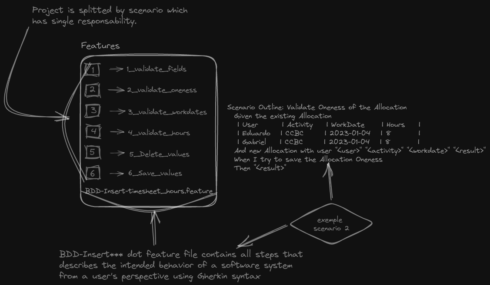

## Introduction

Behavior driven development allows for the use of established standards and
specifications to design, create, test, and document software. It also
emphasizes the ability to reuse and modify existing code and accurately estimate
the effort and risk of making changes.

## Usage

Once `npm run build` was run then run `npm run test`

## Some insights about BDD to the development process.

### Pros:
> - Ensures the software meets user needs by focusing on its behavior.
> - Improves communication and reduces misunderstandings through collaboration between stakeholders.
> - Catches issues early in the development process by emphasizing early and frequent testing.
> - Identifies gaps in requirements and areas where more information is needed.

### Cons:
> - Time-consuming in the early stages of defining requirements.
> - Requires significant collaboration and communication, which can be challenging in large or distributed teams.
> - Difficult to implement in legacy systems or projects with unclear or changing requirements.
> - Can be intimidating for some developers as it adds an extra layer of complexity to the development process.

## How this project is organized.



## Explore Further
In this scenario below, the aim is to validate the "oneness" of the allocation, which each user should only have one allocation for a specific activity and work date. The scenario is using a table format to provide data for both the existing allocation and a new allocation.
```
**1** Scenario Outline: Validate Oneness of the Allocation
**2**  Given the existing Allocation
          | User       | Activity  | WorkDate     | Hours    |
          | Eduardo    | CCBC      | 2023-01-04   | 8        |
          | Gabriel    | CCBC      | 2023-01-04   | 8        |
**3**  And new Allocation with user "<user>" "<activity>" "<workdate>" "<result>"
**4**  When I try to save the Allocation Oneness
**5**  Then "<result>"
```
1. The scenario outline defines the following steps:

2. Given the existing allocation: This step initializes the test by providing the pre-existing allocation data for the specified users, activities, work dates, and hours.

3. And new allocation with user ```"<user>" "<activity>" "<workdate>" "<result>"```: This step creates a new allocation with the specified user, activity, work date, and expected result.

4. When I try to save the Allocation Oneness: This step invokes the application's functionality to validate the oneness of the allocation.

5. Then ```"<result>"```: This step asserts that the actual result of the oneness validation matches the expected result specified in the previous step.

## Disclaimer
We haven't conducted any tests on the database design and frontend to determine if BDD could be utilized on those projects.
